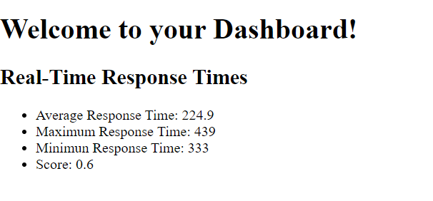

# EC463 Miniproject - by Yiwen & Louis

This project uses the Raspberry Pi Pico, Google Firebase, Web Application Design

## Exercise 1
* Code to find approximate max_bright and min_bright values

## Exercise 2
* Code to play several notes in a sequence from a song
  
## Exercise 3
* Design a web application with the functionality of username-password login using authentication from Google Firebase. Once the user logs in, they will see the response time data fetched from the database.
* Design a button game that calculates users' response time and score using Raspberry Pi Pico. The response time data will be pushed to the Google Firebase database.

